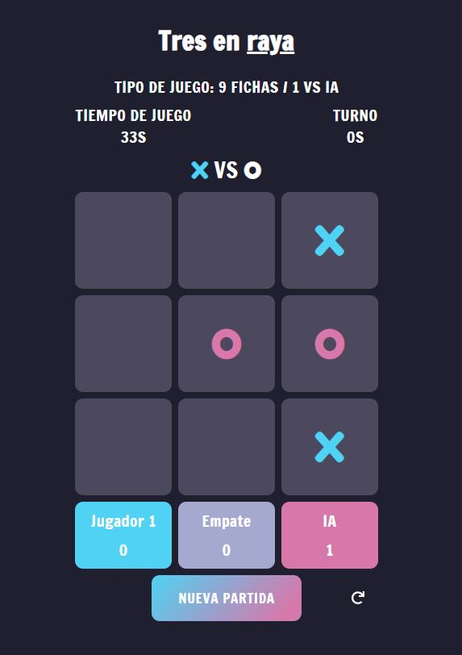

# Tic Tac Toe

## About The Project

    

A classic game of Tic Tac Toe implemented in JavaScript. This implementation of the game includes two play modes: 9 coins max and
6 coins max; and you can play against another player, against a randomized computer, and against the AI.

The AI is implemented using the minimax algorithm.

You can play the game <a href="https://ada-ip.github.io/tic-tac-toe/" target="_blank">here</a>

## How To Play

Tic Tac Toe is a two-player game. The goal is to get three of your coins (either X or O) in a row, either vertically,
horizontally, or diagonally. The first player to get three in a row wins the game. If all the spaces are filled and no one has
three in a row, the game is a draw.

You can choose to play against another player, against the randomized computer (the computer will choose randomly where to put the
coin), and against the AI.

You can play with 9 coins max per game or 6 coins max.

### Game Mode: 9 Coins Max

In the 9 coins max game mode both players put their coins one by one on the board until one of the players wins or there is a
draw.

### Game Mode: 6 Coins Max

In the 6 coins max game mode each player has three coins, and if both of them put all three coins on the board and no one wins,
then they have to move one of their coins to another cell of the board until one of the players win.

There can't be a draw in this game mode.

### Built With

-   HTML.
-   CSS.
-   Javascript.

## Author

[ada-ip](https://github.com/ada-ip)
